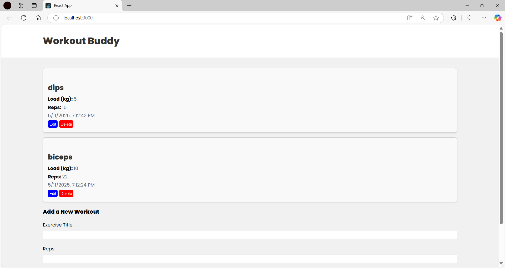
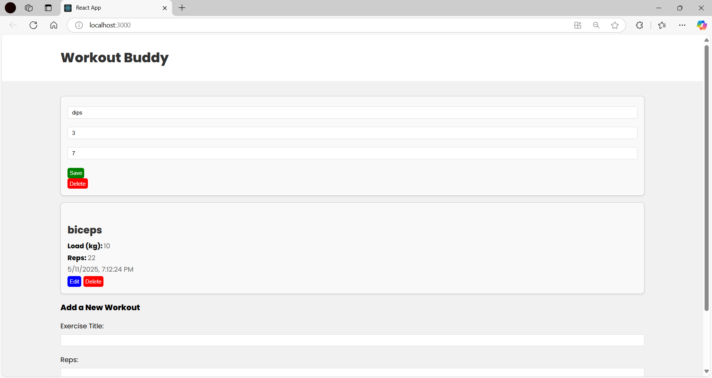
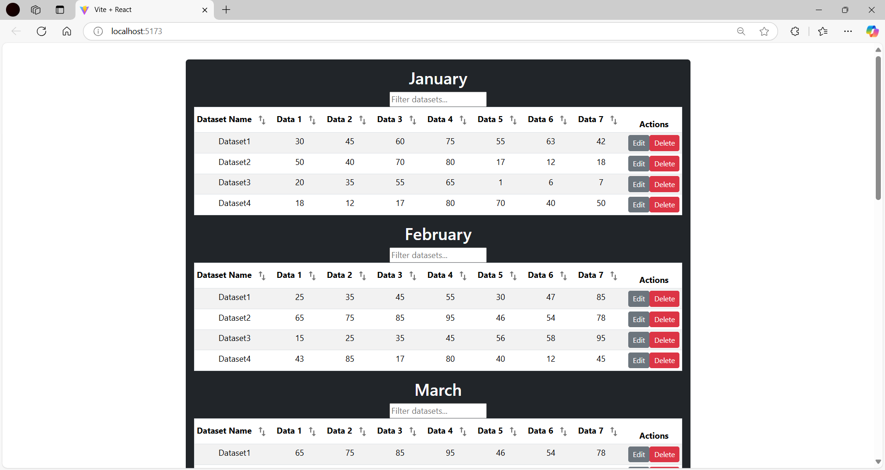
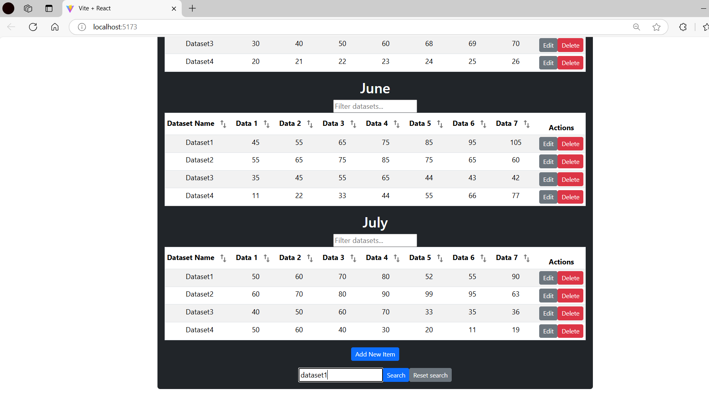
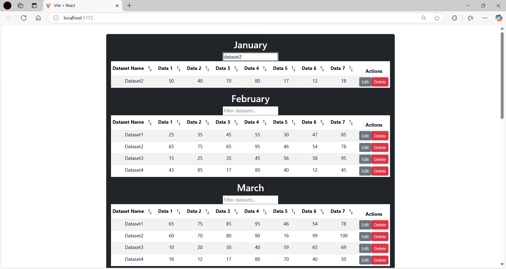
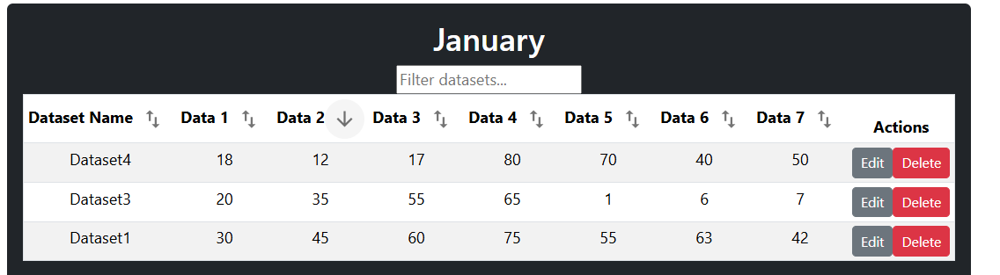
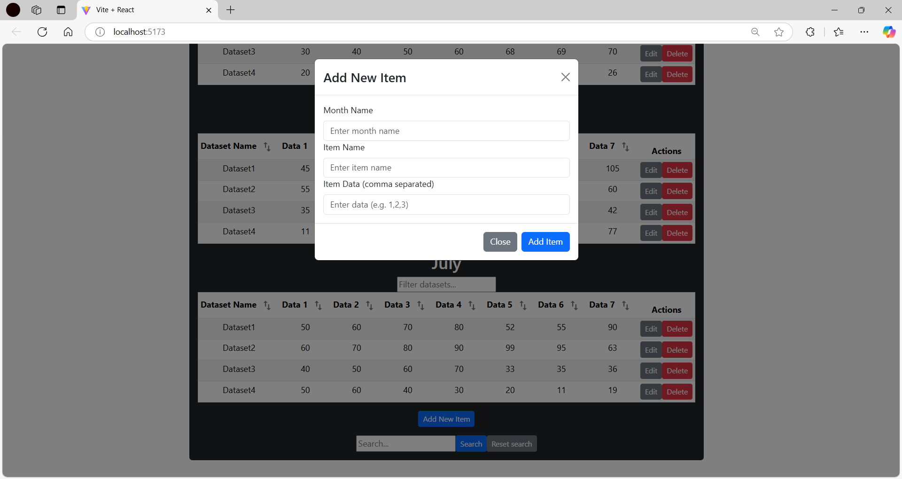
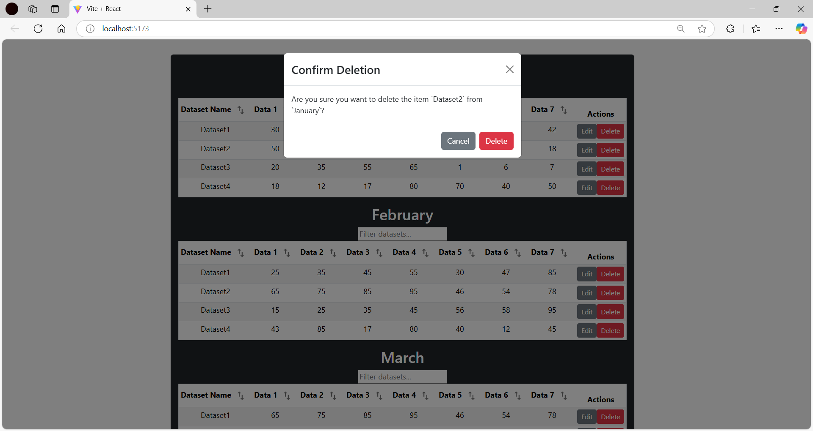

# 🧪 Mini Web Development Projects – Self-Learning MERN & React

This repository contains two mini projects developed as part of a self-learning journey to explore modern full-stack web development using the **MERN stack** and **React with Vite**.

These projects are not production-ready and were created purely for **learning and practice purposes**.

---

## 📁 Project 1: Gym Tracker App (MERN Stack)

**Path:** `gym-app/`

A simple full-stack fitness tracker app where users can add, update, and delete workout entries. Built using MongoDB, Express.js, React, and Node.js.

### 🔧 Features
- Add, view, and delete workouts
- Backend: Node.js + Express + MongoDB (Mongoose)
- Frontend: React + Context API
- Data is stored locally using a MongoDB instance

### 🚀 Run Instructions
```bash
# Backend
cd gym-app/backend
npm install
npm start

# Frontend (in new terminal)
cd gym-app/frontend
npm install
npm start
```

Make sure MongoDB is running locally (`mongodb://localhost:27017/gym-app`).

---

### 📸 Screenshots

#### 🏋️ After Adding a Workout


#### ✏️ Editing a Workout


---

## 📁 Project 2: Table Manager App (React + Vite)

**Path:** `table_application/vite-project/`

A React application built with **Vite** that allows users to search, filter, sort, add, and delete data rows in a dynamic table. Uses local JSON files for data simulation.

### 🔧 Features
- Search, sort, and filter entries
- Modal to add new data
- Confirmation popup for delete
- Built with modular React components and Vite

### 🚀 Run Instructions
```bash
cd table_application/vite-project
npm install
npm run dev
```

### 📸 Screenshots

| Home | Search | Filter | Sort |
|------|--------|--------|------|
|  |  |  |  |

| Add Item | Delete |
|----------|--------|
|  |  |

---

## 👨‍💻 Author

**Hassan Mroueh**
Master’s Student in Automation & Robotics – TU Dortmund
This repository was created as part of self-driven experimentation to better understand web technologies in a hands-on way.
